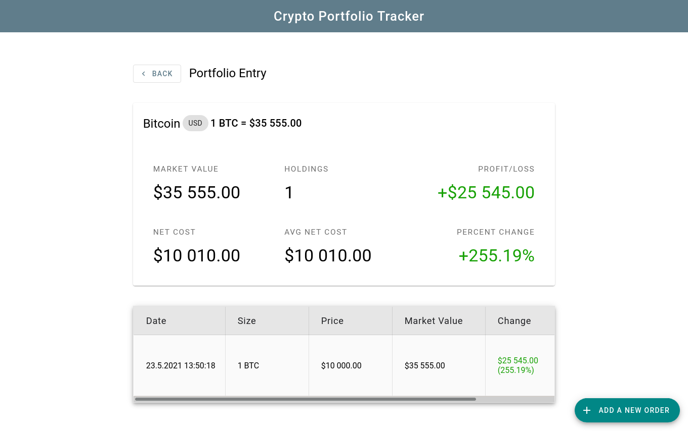

# Crypto Portfolio Tracker
A tracker of your crypto portfolio, written in C# using .NET core. Made as KIV/NET semester project at Západočeská univerzita v Plzni.

## Features
- create and manage portfolios
- create and manage portfolio entries
- add transactions that are linked to portfolio entries
- see summaries of portfolios, portfolio entries and transactions
    - based on current cryptocurrency market data fetched from [CoinGecko](https://www.coingecko.com/en/api)
## Electron
- install required tools from [Electron.NET](https://github.com/ElectronNET/Electron.NET) then run:

```electronize start /PublishSingleFile false /PublishReadyToRun false --no-self-contained```
  
